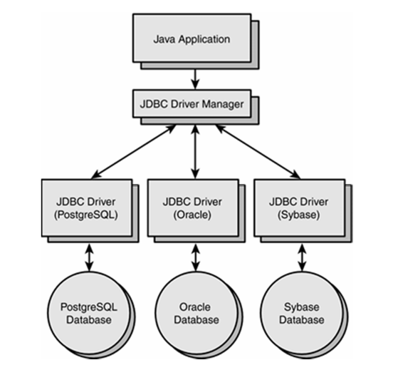
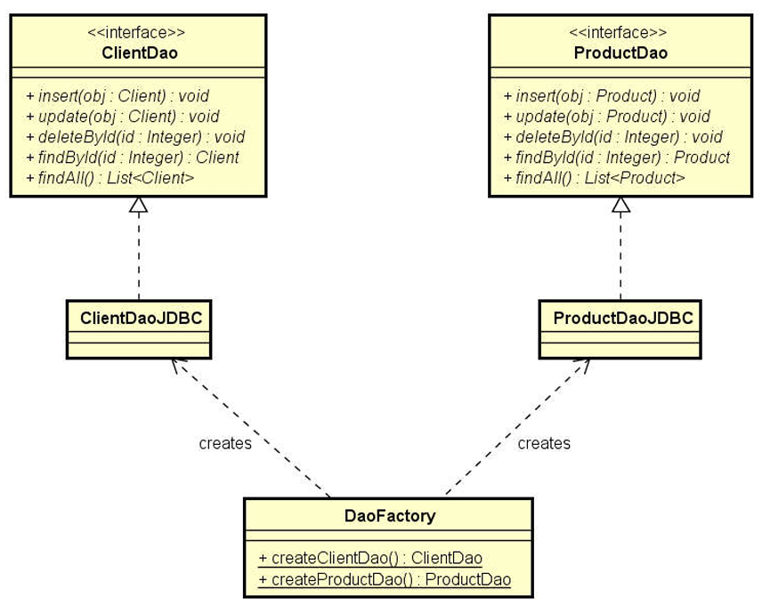
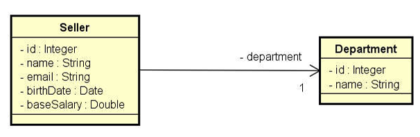

<h1 align="center">🔗 Acesso a Banco de Dados com JDBC e Padrão de Projeto DAO </h1>

<h2 align="center">Curso: Programação Orientada a Objetos com Java - Udemy </h2>

Este repositório contém os exercícios e exemplos do curso de JDBC (Java Database Connectivity), abrangendo a teoria e prática da conexão de bancos de dados com Java, utilizando MySQL e o padrão de projeto DAO (Data Access Object).

## Visão geral do JDBC



### Objetivos do Curso

- Conhecer os principais recursos do JDBC na teoria e prática.
- Elaborar a estrutura básica de um projeto com JDBC.
- Implementar o padrão DAO manualmente com JDBC.

### O que é JDBC?

JDBC é uma API padrão do Java para acessar dados em bancos de dados relacionais. A API fornece interfaces e classes para realizar operações de banco de dados como consulta, atualização e inserção de dados.

### Páginas Oficiais

- [Documentação do JDBC - Oracle](https://docs.oracle.com/javase/8/docs/technotes/guides/jdbc/)
- [API do JDBC - Oracle](https://docs.oracle.com/javase/8/docs/api/java/sql/package-summary.html)

### Pacotes

- **java.sql**: Contém as interfaces e classes fundamentais para JDBC.
- **javax.sql**: API suplementar, utilizada principalmente em servidores.

## Instalação das Ferramentas

1. **MySQL Server** e **MySQL Workbench**:
   - Instale o MySQL Server para rodar o banco de dados.
   - Utilize o MySQL Workbench para interagir com o banco de dados.

2. **MySQL Java Connector**:
   - Baixe o MySQL Java Connector para permitir a conexão entre o Java e o MySQL.
     
3. **Criação do Banco de Dados**:
   - Usando o MySQL Workbench, crie o banco de dados chamado `coursejdbc`.
  
## Estrutura de Pacotes do Projeto
O projeto é estruturado para permitir o aprendizado gradual do uso de JDBC, com pacotes separados que implementam diferentes funcionalidades e conceitos à medida que o conhecimento avança. Cada pacote dentro da pasta jdbc apresenta uma funcionalidade distinta relacionada ao uso de JDBC.

```plaintext
demo_dao_jdbc/
├── application/
│   └── (classes principais da aplicação)
├── db/
│   └── (manipulação da conexão com o banco de dados)
├── model/
│   ├── dao/
│   │   ├── impl/
│   │   │   ├── DaoFactory.java
│   │   │   ├── DepartmentDao.java
│   │   │   └── SellerDao.java
│   └── entities/
│       └── (entidades e modelos do projeto)
└── db.properties (arquivo de configuração do banco de dados)

jdbc/
├── application/
│   └── (classes principais da aplicação)
├── db/
│   └── (manipulação da conexão com o banco de dados)
└── db.properties (arquivo de configuração do banco de dados)
```

## 📂 Pacotes e Aprendizados  

📁 **jdbc1: Conexão Básica com o Banco de Dados**  
O primeiro pacote que criei foi focado em estabelecer a conexão básica com o banco de dados. Aqui, aprendi como configurar e conectar minha aplicação ao banco utilizando a classe `Connection`. Embora não realizasse operações complexas, a conexão é o primeiro passo fundamental para interagir com o banco de dados.  
**📌 Aprendizado:** Como estabelecer a conexão inicial com o banco de dados.

📁 **jdbc2: Consulta SQL com Statement**  
Após a conexão ser estabelecida, o próximo passo foi aprender a realizar consultas SQL utilizando a classe `Statement`. Este pacote me ensinou a executar comandos SQL para buscar dados de uma tabela e exibi-los no console.  
**📌 Aprendizado:** Como executar uma consulta SQL simples e exibir os resultados.

📁 **jdbc3: Inserção de Dados com PreparedStatement**  
Com a introdução ao `PreparedStatement`, passei a entender como inserir dados no banco de forma segura. A principal vantagem do `PreparedStatement` é a prevenção de **SQL Injection**, além de permitir o retorno de IDs gerados automaticamente.  
**📌 Aprendizado:** Como inserir dados de forma segura e evitar falhas de segurança.

📁 **jdbc4: Atualização de Dados com PreparedStatement**  
Neste pacote, aprendi como realizar atualizações de dados no banco de dados. Utilizando `PreparedStatement`, fui capaz de modificar dados existentes em registros específicos, com parâmetros dinâmicos para determinar quais dados seriam alterados.  
**📌 Aprendizado:** Como atualizar registros no banco de dados de forma segura e dinâmica.

📁 **jdbc5: Deleção de Dados com PreparedStatement e Tratamento de Exceções**  
Este pacote foi uma introdução ao tratamento de **exceções**. Aprendi a excluir registros de uma tabela e também a lidar com possíveis erros, garantindo que minha aplicação fosse robusta e capaz de lidar com falhas inesperadas sem comprometer o funcionamento do sistema.  
**📌 Aprendizado:** Como excluir registros e tratar exceções durante a execução de operações no banco de dados.

📁 **jdbc6: Gerenciamento de Transações (Commit/Rollback) com JDBC**  
Por fim, o gerenciamento de **transações** foi o último conceito aprendido. Aprendi como garantir que múltiplas operações de banco de dados sejam realizadas de forma **atômica**, utilizando `commit` para confirmar as mudanças e `rollback` para desfazê-las em caso de erro. Isso é essencial para garantir a **integridade dos dados** durante a execução de operações complexas.  
**📌 Aprendizado:** Como controlar transações no banco de dados com `commit` e `rollback`.

## Padrão de projeto DAO (Data Access Object)

### Referências

- [DevMedia - DAO Pattern](https://www.devmedia.com.br/dao-pattern-persistencia-de-dados-utilizando-o-padrao-dao/30999)
- [Oracle - Data Access Object](https://www.oracle.com/technetwork/java/dataaccessobject-138824.html)

### Ideia geral do padrão DAO

- Para cada entidade, haverá um objeto responsável por fazer acesso a dados relacionado a esta entidade. Exemplos:
  - Cliente: `ClienteDao`
  - Produto: `ProdutoDao`
  - Pedido: `PedidoDao`
  
- Cada DAO será definido por uma **interface**.
  
- A **injeção de dependência** pode ser feita por meio do padrão de projeto **Factory**.



## Modelo de domínio utilizado no projeto demo_dao_JDBC



### Entity Class Checklist

- **Attributes**
- **Constructors**
- **Getters/Setters**
- **hashCode and equals**
- **toString**
- **Implements Serializable**

```sql
Reusing instantiation:

private Seller instantiateSeller(ResultSet rs, Department dep) throws SQLException { 
    Seller obj = new Seller(); 
    obj.setId(rs.getInt("Id")); 
    obj.setName(rs.getString("Name")); 
    obj.setEmail(rs.getString("Email")); 
    obj.setBaseSalary(rs.getDouble("BaseSalary")); 
    obj.setBirthDate(rs.getDate("BirthDate")); 
    obj.setDepartment(dep); 
    return obj; 
} 

private Department instantiateDepartment(ResultSet rs) throws SQLException { 
    Department dep = new Department(); 
    dep.setId(rs.getInt("DepartmentId")); 
    dep.setName(rs.getString("DepName")); 
    return dep; 
}
```

**SQL Query:**
```sql
findById Implementation
SELECT seller.*, department.Name as DepName  
FROM seller INNER JOIN department ON seller.DepartmentId = department.Id  WHERE seller.Id = ?

findByDepartment Implementation
SELECT seller.*, department.Name as DepName FROM seller 
INNER JOIN department ON seller.DepartmentId = department.Id WHERE DepartmentId = ? ORDER BY Name INCORRECT CORRECT

findAll Implementation
SELECT seller.*, department.Name as DepName  
FROM seller INNER JOIN department ON seller.DepartmentId = department.Id ORDER BY Name

Insert Implementation
INSERT INTO seller (Name, Email, BirthDate, BaseSalary, DepartmentId) VALUES  (?, ?, ?, ?, ?)

Update Implementation
UPDATE seller SET Name = ?, Email = ?, BirthDate = ?, BaseSalary = ?, DepartmentId = ?  WHERE Id = ?

Delete Implementation
DELETE FROM seller WHERE Id = ?
```

## 📌 Sobre os Projetos

Este projeto foi desenvolvido em **Java** como parte do curso ministrado pelo professor [Nélio Alves](https://github.com/acenelio), com o objetivo de praticar **POO** e aprofundar o conhecimento em **JDBC** para manipulação de bancos de dados.

Durante o desenvolvimento, explorei desde a conexão inicial com o banco até operações avançadas, como **consultas, inserções, atualizações, deleções** e **gerenciamento de transações (commit/rollback)**, garantindo a integridade dos dados. Além disso, utilizei **PreparedStatement** para prevenir **SQL Injection** e implementei **tratamento de exceções** para tornar a aplicação mais segura e robusta.

Para organizar o acesso aos dados de forma modular e reutilizável, apliquei o **padrão de projeto DAO (Data Access Object)**. Esse padrão separa a lógica de persistência da lógica de negócios, tornando o código mais estruturado, facilitando a manutenção e permitindo maior escalabilidade da aplicação. 

Além da implementação original, foram realizadas modificações na organização dos packages para aprimorar a estrutura e a legibilidade do código. Além disso, a interface de exibição no console foi ajustada para proporcionar uma melhor experiência visual e usabilidade.

## Autor

👤 **Albert Silva**
